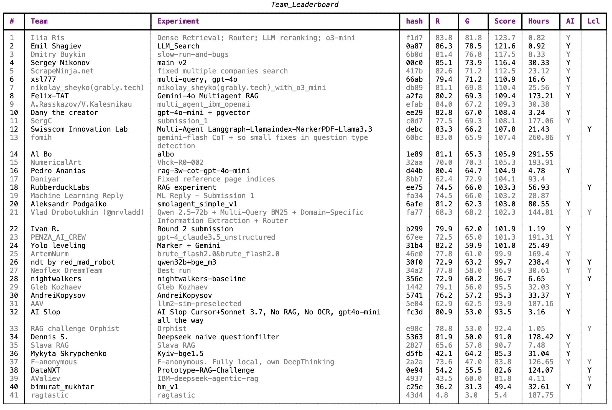

# Enterprise RAG Challenge with Annual Reports

BEFORE CLONING: Be aware that this repo has around 1,4GB (due to large PDFs contained). 

##  Round 1 - Sept. 2024
You can find all infos on the first run in the folder [round1](round1). Make sure to check out the [README](round1/README.md) there. 


## Round 2 - Feb 2025
👉[Landing page with Results Video and Keynote by Stephan Gillich](https://www.timetoact-group.at/details/enterprise-rag-challenge)👈 


You can find an interactive leaderboard with detailed results [here](https://abdullin.com/erc#r2).

The data for the test run of the round 2 can be found in the [samples](round2/samples) folder.


### Explanation

We have been discussing various approaches for building AI-driven assistants for companies. Most of the discussions focused on the efficiency and accuracy achieved by different approaches: RAG systems with vector databases and Domain-Driven AI Assistants (with Knowledge Maps).

In the long run, the technologies don’t even matter that much - they are just the implementation details. The only thing that is important - does the LLM-driven system provide accurate answers or does it hallucinate on the spot.

We can measure that! The idea started as a friendly competition challenge between a couple of teams.
Anybody interested can bring their own RAG system of choice into the game (or build one from scratch). This RAG should be able to ingest a bunch of public annual reports and answer questions.

All questions will be based on information retrieval tasks: “How many people are employed at the company X?”, “Which company has more liquidity?”, “Does the company X invest in green bonds?”

By the way, this test represents a real business case that is quite valuable for companies. First of all, here we can measure and compare the accuracy and hallucination rates of different approaches. Additionally, question answering over a large corpus of data maps well to cases like enterprise lead generation or internal customer support.

Participants can use any technology they wish to. It could be local, cloud-hosted or even third-party. The only requirements are:

- You can upload a test set of public annual reports.
- You can upload a list of questions to the system and get a list of answers.
- Between steps 1 and 2, there will be a lag of a few hours, so that the systems could ingest the data (e.g. compute embedding vectors or populate knowledge maps).
- There is no need to share the source code of the system.

If you are interested, below is the link for a sample subset of PDFs for development. Test dataset will obviously contain different PDFs.


### Geeky Details

We want to make the competition open and fair to everyone, so we invested extra effort in that.

All participants, even TimeToAct will be in the same conditions:

1. We share a list of all annual reports (7496 files and ~46GB) along with company names and file sha1 hashes in [dataset.csv](dataset.csv). These annual reports are public information. **We don't share all 46GBs of these PDFs upfront, but if you really want, you can find them on the Internet.**
2. We share a code that will generate next unpredictable random seed for the competition. It uses public blockchain API. See [gen_seed.py](gen_seed.py) for the implementation details.
3. We share the question generator that will randomly pick a subset of files for the competition. It will also generate random questions for these files. See [main.py](main.py).
4. Question generator uses a deterministic RNG that will work similarly for everybody.

Anybody can run this code at the moment of competition. Everybody is guaranteed to get the same list of files and questions for the competition at the same time. Nobody should be able to figure out these files and questions in advance.

As soon as we have a list of PDF files, TimeToAct will package them into a zip and share publicly. Everybody can verify sha1 hashes of these files to check that the files were not modified.


### Test Run

For verification, we did make a test run with 20 files and 40 questions.

You can find a list of files and questions in [samples](round2/samples) folder. Below is the explanation of the process.

First, we waited for the next random seed:
```bash
python3 gen_seed.py
# Current block: 855626 at 2024-08-06 08:38:28. Waiting for new block...
# ..............New block found! 855627 at 2024-08-06 08:52:02
# Deterministic seed: 1836201229
```
(note that this was using the old random number generator of [round1](round1/gen_seed.py)!)


Then we sampled dataset.csv for a list of 20 files using that seed:
```bash
python3 main.py step1 --seed=1836201229 --count=20            ~/tat/enterprise-rag
# 053b7cb83115789346e2a9efc7e2e640851653ff Global Medical REIT Inc.
# 3696c1b29566acc1eafc704ee5737fb3ae6f3d1d Zegona Communications plc
# 40b5cfe0d7bbf59e186492bfbe1b5002d44af332 Calyxt, Inc.
# 4b525836a5d7cb75489f6d93a3b1cf2b8f039bf2 TD SYNNEX
# 58a5f9f5c83159e63602b0b1dd27c27fb945c0e9 Eurocell PLC
# 608c5097dfc6e83505fd2259ad862dcec11a3f96 Sandwell Aquatics Centre
# 6b79f1c1de9d0e39a4576dcd4585849b9465b402 Mercurity Fintech Holding Inc.
# 71b04e0248ecf758990a0ab77bd69344be63bcf4 Motus GI Holdings, Inc.
# 99be213e4e689294ebae809bfa6a1b5024076286 Limbach Holdings, Inc.
# 9ae3bb21564a5098c4b4d6450655c22eff85deae Strike Energy Limited
# 9e703e719d94af786af5511c823ff86e9f04c070 Platform Technology
# 9ff4e041732c9841d5423e6ea0bbd6a0320df9ff VENUS METALS CORPORATION LIMITED
# bd5041c3e6909d92a7a88e4fb10dd8651df33228 NICE
# d734bac4a4815e616d84083ad4d3844655321215 Nykredit
# d81bbc64a4160b9946fea7a895f80e6201f52f27 Air Products
# dd78f748262b8ffa62de6484143ff55b38af24c7 Accuray Incorporated
# dfb1e552b18e116105d9125d9becafa443950e97 Kooth Plc
# e51b7204b91cbe7709bd3218e7d2d0c2b8dbb438 Ethernity Networks Ltd
# ea0757d27fa67cd347d9f046b939a911f5c9a08d Canadian Banc Corp.
# faf8d7d79152d61279eda1cfb58b8236ce2f82fa EMT
```

These files are uploaded to [samples](round2/samples) folder. You can verify their hash using this code:

```py
import hashlib
from pathlib import PosixPath

def sha1_hash(file_path: PosixPath) -> str:
    sha1 = hashlib.sha1()
    with file_path.open('rb') as f:
        while chunk := f.read(8192):
            sha1.update(chunk)
```

Afterwards we waited for the next random seed:

```bash
python3 gen_seed.py
# New block found! 855628 at 2024-08-06 08:58:35
# Deterministic seed: 3031428637
```
(note that this was using the old random number generator of [round1](round1/gen_seed.py)!)


Then we generated a list of questions using command:
```bash
python3 main.py step2 --seed=3031428637 --count=40
```

It generated questions like the ones below (full list is in [samples/questions.json](round2/samples/questions.json)):

1. number: How much did "Accuray Incorporated" spend on risk management in Q2 2022?
2. name: Who is the CEO in the company "Zegona Communications plc"?
3. boolean: Did "Global Medical REIT Inc." have a greater Debt-to-Equity ratio than "Zegona Communications plc" in Q2 2021?
4. number: How many stores did "Accuray Incorporated" have in the end of fiscal year 2021?
5. number: How much did "Sandwell Aquatics Centre" spend on R&D in Q2 2023?
6. name: Who is the CFO in the company "EMT"?
7. boolean: Did "Calyxt, Inc." have a greater Return on Assets (ROA) than "Global Medical REIT Inc." in Q2 2023?


The final seeds drawn with the new question generator for `round2` are:
- sample dataset creation: 77040339 (verifiable via https://api.drand.sh/public/4840674) 
- question generation: 96461695 (verifiable via https://api.drand.sh/public/4840954)


### Schema

#### Generator Schema
Note the schema specified for each question. It follows this pydantic schema:

```py
from pydantic import BaseModel
from typing import Literal

class Question(BaseModel):
    text: str
    kind: Literal["number", "name", "boolean", "names"]
```


#### Submission Schema

For submission, we recommend using this schema:

```py
from pydantic import BaseModel, Field
from typing import Optional, List, Union, Literal

class SourceReference(BaseModel):
    pdf_sha1: str = Field(..., description="SHA1 hash of the PDF file")
    page_index: int = Field(..., description="Zero-based physical page number in the PDF file")

class Answer(BaseModel):
    question_text: Optional[str] = Field(None, description="Text of the question")
    kind: Optional[Literal["number", "name", "boolean", "names"]] = Field(None, description="Kind of the question")
    value: Union[float, str, bool, List[str], Literal["N/A"]] = Field(..., description="Answer to the question, according to the question schema")
    references: List[SourceReference] = Field([], description="References to the source material in the PDF file")

class AnswerSubmission(BaseModel):
    team_email: str = Field(..., description="Email that your team used to register for the challenge")
    submission_name: str = Field(..., description="Unique name of the submission (e.g. experiment name)")
    answers: List[Answer] = Field(..., description="List of answers to the questions")
```

* number - only a metric number is expected as an answer. No decimal commas or separators. Correct: `122333`, incorrect: `122k`, `122 233`
* name - only name is expected as an answer. 
* names - multiple names
* boolean - only `yes` or `no` (or `true`, `false`). Case doesn't matter.

Important! Each schema also allows `N/A` or `n/a` which means "Not Applicable" or "There is not enough information even for a human to answer this question".

Adding the optional `question_text` element to `Answer` will allow the submission API to check if your answers are in the right order for correct scoring.  


#### Submission
Submission was done via a provided API and user interface ([source code](https://github.com/trustbit/enterprise-rag-challenge-ui/tree/main/)) with verifiable [TSP signature](https://github.com/pyauth/tsp-client).

All submissions can be found in anonymized form in the [submissions](round2/submissions) folder.


### Frequently Asked Questions

**Will you share all 46GB of Annual Report PDFs?**

No, we'll share only the competition subset as soon as it is known. These annual reports are public. If you really want, you can gather them on the internet.

**Why do questions include company names that are not included in PDFs?**

The purprose here is to detect hallucinations. If company data is not available in competition PDFs, then the RAG system must respond with `N/A` for the question.


**Why do some questions don't make sense?**

You will see questions that don't make sense, for example: 

* number: How many stores did "Strike Energy Limited" have in the end of fiscal year 2021?

Just like in the real world, not all questions make sense. If "Strike Energy Limited" didn't have any stores, the answer should be "N/A".

It is OK for many questions to ask about things that make sense on the surface, but be meaningless for the specific company or a document. A bad RAG system will hallucinate a plausible answer, a good RAG system will respond with "N/A".

**How do we verify correct answers?**

TIMETOACT will collect all answers first. We will then take time to review questions and manually come up with the correct answers. Correct answers will be published, along with the graded answers.

**I want to run a different challenge with tables, my language or industry. How I can do that?**

This repository is available publicly under the Apache 2.0 license, it can be used without restrictions. You can fork it, then:

1. Collect your own dataset of source files.
2. Adjust question generator to make sense for your domain.
3. Follow the overall process.

We only kindly ask to follow the rules of Apache 2.0 license in the process.
